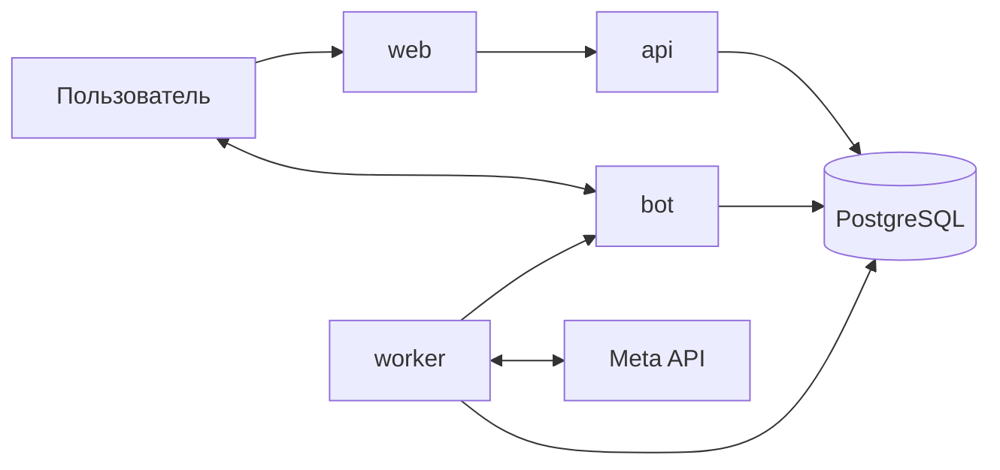

# Buyerly

Buyerly — сервис контроля Meta Ads для байеров: кабинеты, прозрачные сводки, конструктор автоправил, групповые назначения, история действий и Telegram-уведомления.

## Возможности

- массовое добавление кабинетов из текста Meta Business Manager;
- отдельный статус Meta, мониторинга и автоправил для каждого кабинета;
- правила с `AND`/`OR`, временными окнами, интервалом и cooldown;
- остановка/включение адсетов, уведомления и изменение бюджета;
- переиспользуемые группы правил с атомарным назначением;
- сводки с формулами метрик, покрытием данных и признаком свежести;
- журнал действий с фильтрами, причинами, состоянием до/после и correlation ID;
- изоляция данных байеров и административный обзор.

## Архитектура



В production запускаются независимые сервисы `web`, `api`, `bot`, `worker` и `db`. Разделение процессов локализует сбои: Telegram polling и фоновые проверки не делят процесс с веб-интерфейсом. Одноразовый сервис `migrate` готовит схему и безопасно переносит прежнюю SQLite-базу.

## Быстрый старт

Требуются Docker с Compose, Telegram Bot Token и доступ к Meta Marketing API.

```bash
cp .env.example .env
# заполните BOT_TOKEN, ADMIN_CHAT_ID и POSTGRES_PASSWORD
docker compose up -d --build
curl -fsS http://127.0.0.1:8080/health/ready
```

Локальный совместимый режим с SQLite:

```bash
python3 -m venv .venv
source .venv/bin/activate
pip install -r requirements.txt
cp .env.example .env
DATABASE_URL=sqlite+aiosqlite:///mediabuyer.db python main.py
```

## Тесты

```bash
python -m unittest discover tests -v
```

Тесты покрывают движок правил, API и права доступа, парсер кабинетов, аудит, KPI-контракт интерфейса, миграции и контракт production-деплоя.

## Структура

```text
api/                 FastAPI и REST-маршруты
bot/                 Telegram handlers и уведомления
core/                настройки, аудит и безопасные журналы
database/            модели, подключение и SQLite → PostgreSQL migration
meta_api/            клиент Meta Marketing API
rules/               чистый движок условий и действий
scheduler/           MonitoringWorker
services/            отдельные точки запуска API, bot, worker и migration
webapp/              SPA, Nginx и статические ресурсы
scripts/             backup и атомарный production deploy
tests/               unit, integration и contract tests
```

Подробности: [архитектура](docs/ARCHITECTURE.md), [развёртывание](docs/DEPLOYMENT.md), [архитектурные решения](docs/DECISIONS.md), [сквозной аудит продукта](docs/PRODUCT_AUDIT_2026-08-17.md), [работа с Meta-токеном](docs/TOKEN_GUIDE.md).

## Продуктовая разработка

Все согласованные изменения, критерии приёмки и очерёдность отдельных production-релизов ведутся в [product backlog](docs/PRODUCT_BACKLOG.md). Задача закрывается только после тестов, отдельного push, production-проверки и обновления документации.
