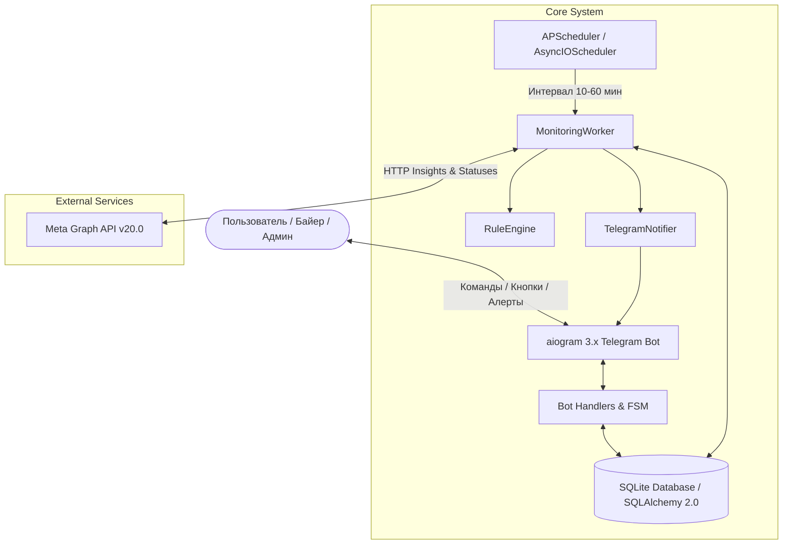

# 🏛 Архитектура системы (Architecture & Technical Deep Dive)

В данном документе подробно описаны внутреннее устройство сервиса **Buyerly (AI Media Buyer)**, структура базы данных, движок правил и механизмы интеграции с Meta Graph API.

---

## 📌 Оглавление
1. [Общая схема компонентов](#1-общая-схема-компонентов)
2. [Модели данных (Database Schema)](#2-модели-данных-database-schema)
3. [Движок правил (Rule Engine)](#3-движок-правил-rule-engine)
4. [Интеграция с Meta Graph API и канонический парсинг](#4-интеграция-с-meta-graph-api-и-канонический-парсинг)
5. [Фоновый мониторинг и логика 00:00 (Scheduler & Worker)](#5-фоновый-мониторинг-и-логика-0000-scheduler--worker)
6. [Архитектура Telegram-бота и FSM](#6-архитектура-telegram-бота-и-fsm)
7. [Безопасность и мульти-пользовательская изоляция](#7-безопасность-и-мульти-пользовательская-изоляция)

---

## 1. Общая схема компонентов



---

## 2. Модели данных (Database Schema)

База данных построена на асинхронном SQLite (`sqlite+aiosqlite`). Модели описаны в [`database/models.py`](../database/models.py):

### 1. `Account` (Рекламные кабинеты)
* `account_id` (`VARCHAR`, PK/Unique) — ID кабинета в формате `act_...`.
* `name` (`VARCHAR`) — Понятное имя кабинета (например, `Швеция_11783`).
* `access_token` (`VARCHAR`) — Meta System User Access Token.
* `owner_id` (`VARCHAR`, Index) — Telegram ID байера-владельца (обеспечивает изоляцию данных).
* `batch_name` (`VARCHAR`) — Название пачки при массовом добавлении.
* `timezone_name` (`VARCHAR`) — Часовой пояс кабинета (например, `America/Adak`, `UTC`).
* `last_started_date` (`VARCHAR`) — Дата последнего зафиксированного старта открута (для 00:00 пуша).
* `max_spend_0_leads` (`FLOAT`, default: `2.0`) — Лимит расхода при 0 конверсиях ($).
* `max_spend_1_lead` (`FLOAT`, default: `6.0`) — Лимит расхода при 1 конверсии ($).
* `max_cpa_multiple_leads` (`FLOAT`, default: `6.0`) — Максимально допустимый CPA при 2+ конверсиях ($).
* `conversion_event` (`VARCHAR`, default: `'all'`) — Тип учитываемых событий (`all`, `leads`, `registrations`).
* `rules_enabled` (`BOOLEAN`, default: `False`) — Включены ли авто-стопы (безопасный старт).
* `account_status` (`INTEGER`) — Числовой статус кабинета в Meta (1: ACTIVE, 2: DISABLED, 3: UNSETTLED и т.д.).
* `status_label` (`VARCHAR`) — Человекочитаемый статус с эмодзи.
* `is_active` (`BOOLEAN`, default: `True`) — Включен ли кабинет в системе мониторинга.

### 2. `TelegramUser` (Пользователи и безопасность)
* `telegram_id` (`VARCHAR`, Unique, Index) — Telegram ID пользователя.
* `username` (`VARCHAR`), `full_name` (`VARCHAR`).
* `role` (`VARCHAR`, `'admin'` или `'buyer'`).
* `is_approved` (`BOOLEAN`) — Флаг доступа по системе Whitelist.

### 3. `StoppedAdSet` (Остановленные адсеты)
* `account_id` (`VARCHAR`, Index) — ID рекламного кабинета.
* `adset_id` (`VARCHAR`, Unique, Index) — ID группы объявлений.
* `adset_name` (`VARCHAR`), `stop_spend` (`FLOAT`), `stop_leads` (`INTEGER`), `stop_registrations` (`INTEGER`).
* `is_resolved` (`BOOLEAN`) — Обработано ли предложение о реактивации.

### 4. `EventLog` (Аудит-лог событий)
* `event_type` (`VARCHAR`) — Тип (`STOP`, `DAY_START`, `PROPOSE_REACTIVATE`, `ACCOUNT_ISSUE` и др.).
* `target_chat_id` (`VARCHAR`), `account_id` (`VARCHAR`).
* `message` (`TEXT`), `status` (`SUCCESS` / `ERROR`), `created_at` (`DATETIME`).

### 5. `AppSettings` (Глобальные настройки)
* `poll_interval_minutes` (`INTEGER`, default: `10`) — Интервал фонового опроса.

---

## 3. Движок правил (Rule Engine)

Движок правил реализован в [`rules/engine.py`](../rules/engine.py) в виде чистой детерминированной функции `RuleEngine.evaluate(adset, account, is_stopped_today)`.

### Дерево решений (Decision Flowchart):

```mermaid
flowchart TD
    Start([Оценка адсета]) --> IsActive{Адсет активен?}
    
    IsActive -- НЕТ --> InactiveNoop[Action: NOOP (Адсет не активен)]
    IsActive -- ДА --> HasConditions{Есть правила?}
    
    HasConditions -- НЕТ --> NoCondNoop[Action: NOOP (Правила не настроены)]
    HasConditions -- ДА --> EvalConditions[Оценка условий: spend, cpl, cpr, cpa, leads, regs, purch, ctr, cpc с учетом time_window]
    
    EvalConditions --> LogicCheck{Logic: AND или OR?}
    
    LogicCheck -- AND --> AllMatch{Все условия совпали?}
    LogicCheck -- OR --> AnyMatch{Хотя бы одно совпало?}
    
    AllMatch -- НЕТ --> Noop1[Action: NOOP]
    AnyMatch -- НЕТ --> Noop2[Action: NOOP]
    
    AllMatch -- ДА --> TriggerAction[Действие правила]
    AnyMatch -- ДА --> TriggerAction
    
    TriggerAction --> ActionType{Тип действия}
    ActionType -- turn_off --> ActStop[Action: STOP (Пауза в Meta)]
    ActionType -- notify_only --> ActNotify[Action: NOTIFY_ONLY (Пуш в TG)]
    ActionType -- turn_on --> ActTurnOn[Action: AUTO_REACTIVATE (Включение)]
    ActionType -- increase_budget --> ActIncB[Action: INCREASE_BUDGET (+% с потолком)]
    ActionType -- decrease_budget --> ActDecB[Action: DECREASE_BUDGET (-% пол $1.00)]
```

---

## 4. Интеграция с Meta Graph API и канонический парсинг

### Проблема задвоения конверсий в Meta API:
Meta Insights API возвращает массив `actions`, где одни и те же действия дублируются под разными типами (например, стандартное событие `lead` и событие пикселя `offsite_conversion.fb_pixel_lead` или `onsite_web_lead`).

### Канонический алгоритм извлечения:
В [`meta_api/client.py`](../meta_api/client.py) внедрена строгая дедупликация:
```python
actions_dict = {act["action_type"]: int(act.get("value", 0)) for act in insight.get("actions", [])}

# Лиды (берем канонический lead, если нет — резервные ключи)
leads = actions_dict.get("lead", actions_dict.get("offsite_conversion.fb_pixel_lead", actions_dict.get("onsite_web_lead", 0)))

# Регистрации
registrations = actions_dict.get("complete_registration", actions_dict.get("offsite_conversion.fb_pixel_complete_registration", actions_dict.get("omni_complete_registration", 0)))

# Покупки
purchases = actions_dict.get("purchase", actions_dict.get("offsite_conversion.fb_pixel_purchase", actions_dict.get("omni_purchase", 0)))
```

---

## 5. Фоновый мониторинг и логика 00:00 (Scheduler & Worker)

Класс `MonitoringWorker` ([`scheduler/worker.py`](../scheduler/worker.py)) выполняет:
1. **Проверку здоровья аккаунтов:** Запрашивает `/act_<ID>`, выявляет баны (status != 1), проблемы с биллингом и просроченные токены (OAuth 190).
2. **Локальное время и 00:00 старт:** Рассчитывает дату и время в часовом поясе кабинета через `zoneinfo.ZoneInfo(account.timezone_name)`. Если зафиксирован спенд $> \$0.00$ в новые сутки, отправляет приветственный пуш о начале работы.
3. **Опрос Insights и выполнение правил:** При `rules_enabled == True` оценивает каждый адсет. При необходимости остановки вызывает `POST /{adset_id} status=PAUSED` и фиксирует запись в `StoppedAdSet`.

---

## 6. Архитектура Telegram-бота и FSM

Пользовательский интерфейс построен на `aiogram 3.x` с поддержкой конечных автоматов (FSM):

### 1. FSM добавления кабинетов (`BatchAccountAddStates`):
* `waiting_for_ids`: Принимает сырой текст или список ID/названий. Функция `parse_fb_raw_accounts` автоматически вычленяет кабинеты.
* `waiting_for_name`: Запрашивает имя пачки или подтверждение.
* `waiting_for_token`: Принимает Access Token, валидирует через Meta API, считывает таймзоны кабинетов и сохраняет их в базу данных с привязкой к `owner_id`.

### 2. FSM ручной настройки лимитов (`ManualLimitsStates`):
* Позволяет ввести произвольные 3 числа: `лимит_0`, `лимит_1`, `макс_cpa` (например, `3.5 7.0 7.0`).

---

## 7. Безопасность и мульти-пользовательская изоляция

* **Whitelist-доступ:** Любой новый пользователь, запустивший бота, попадает в статус `is_approved = False`. Запрос с кнопками `[✅ Одобрить]` / `[❌ Отклонить]` уходит главному администратору (`ADMIN_CHAT_ID`).
* **Изоляция данных:** Запросы сводок (`📊 Сводка`), расходов (`💵 Расходы`) и списка кабинетов фильтруются по `owner_id == str(user_id)`.
* **Супер-администратор:** Пользователь с ID `ADMIN_CHAT_ID` видит агрегированную аналитику по всем кабинетам команды и имеет доступ к меню `👑 Админ-панель`.
