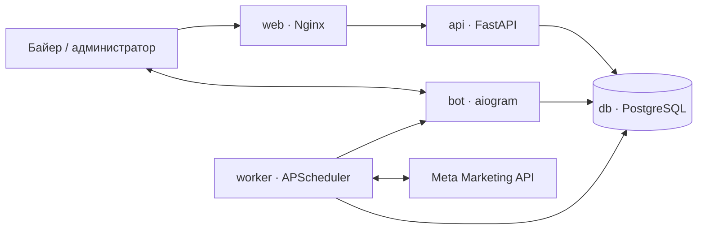

# Архитектура Buyerly

## Контуры системы

Продакшен состоит из независимых сервисов:

- `web` отдаёт интерфейс и направляет `/api/*` и `/health/*` в API;
- `api` отвечает за авторизацию, кабинеты, правила, группы правил, сводки и аудит;
- `bot` обрабатывает Telegram-команды и интерактивные действия;
- `worker` раз в минуту определяет, какие кабинеты и правила пора проверить, работает с Meta и сохраняет результат;
- `db` хранит данные в PostgreSQL 16;
- `migrate` — одноразовый процесс подготовки схемы и переноса прежней SQLite-базы.

Такое разделение не даёт сбою Telegram polling или фоновой проверки уронить веб-интерфейс. API можно проверять отдельно через `/health/live` и `/health/ready`.

## Данные

SQLAlchemy-модели находятся в `database/models.py`:

- `TelegramUser` — пользователь, роль и доступ;
- `Account` — Meta-кабинет, владелец, статус и назначенные правила;
- `RulePreset` — исполняемое правило;
- `RuleGroup` и `RuleGroupItem` — переиспользуемая упорядоченная группа правил;
- `StoppedAdSet` — остановленный адсет, ожидающий решения;
- `SummarySnapshot` — сохранённая сводка Meta для конкретного пользователя и периода, включая полные значения кабинетов без секретов;
- `AnalyticsViewPreference` — сохранённый набор видимых колонок аналитики и выбранное представление пользователя;
- `AuditEvent` — неизменяемая история действий продукта;
- `EventLog` — история доставки уведомлений;
- `AppSettings` — общие настройки мониторинга.

Первый переход на PostgreSQL выполняется транзакционно. Копирование начинается только в пустую целевую базу, после чего количество строк сверяется по каждой таблице. При ошибке транзакция откатывается, а прежний контейнер можно вернуть.

## Жизненный цикл сводки

`GET /api/summary?period=...` сначала проверяет короткий кеш процесса, затем последний снимок в PostgreSQL. Это позволяет мгновенно восстановить экран после перезагрузки без нового обращения к Meta. `force=true` получает account-level Insights из Meta, формирует новый снимок и возвращает ссылку на предыдущие итоговые значения. Интерфейс обновляет только открытую видимую сводку раз в 3 минуты и никогда не заменяет последний успешный снимок пустым экраном при временной ошибке.

История ограничена 100 снимками на пользователя и период. В JSON снимка не попадают access token, авторизационные данные или другие секреты.

Account-level запрос включает только видимые в текущем интерфейсе лёгкие поля: Spend, Impressions, Reach, Frequency, CPM, All/Unique/Inline Link/Outbound Clicks и Actions. Landing Page Views и события воронки извлекаются из Actions с канонической дедупликацией. Производные показатели рассчитываются из итоговых сумм, а не усреднением процентов отдельных кабинетов.

## Представления аналитики

`GET /api/analytics-view` возвращает сохранённое представление текущего пользователя, а `PUT /api/analytics-view` сохраняет выбранный готовый вид, ручной набор, порядок и ширину колонок. Настройки изолированы по владельцу и не содержат рекламные данные или секреты. Кабинет и статус данных остаются обязательными колонками, чтобы таблица никогда не теряла контекст и признаки качества данных. API принимает только известные ключи, ограничивает ширину диапазоном 72–420 px и автоматически дополняет старые настройки новыми полями.

Системный полный вид используется до первого сохранения. Готовые представления «Обзор», «Доставка», «Трафик» и «Воронка» меняют только таблицу кабинетов; верхние KPI, определения метрик, время обновления и показатели качества остаются на месте.

## Автоправила

`MonitoringWorker` выбирает активные кабинеты, рассчитывает срок следующей проверки для каждого правила и запрашивает Meta только для тех правил, которым уже пора выполняться. `RuleEngine` вычисляет условия без сетевых вызовов. Любое реальное действие и ошибка записываются в `AuditEvent` независимо от доставки Telegram-уведомления.

Поддерживаются действия `turn_off`, `turn_on`, `notify_only`, `increase_budget`, `decrease_budget`, логика `AND`/`OR`, интервалы проверки и cooldown.

## Границы доступа

Обычный байер видит и изменяет только свои кабинеты, правила, группы и историю. Администратор имеет общий обзор. Веб принимает подписанные данные Telegram или постоянный токен входа. Секреты Meta и Telegram удаляются из журналов форматтером до записи на диск.
